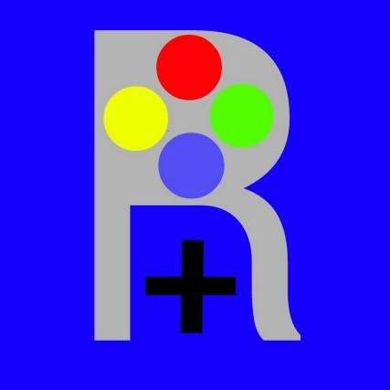

<html>
	<head>
		<title>
		Mundo RGT
		</title>
		
	</head>
	<body >
		<h1>
			

			<strong>
			Bienvenido a mi pagina oficial :)
			</strong>
			

		</h1>
		<h2>
			
			¿Quien soy?
			
		</h2>
		
		

		 Soy una persona que le gusta subir videos a yuotube y divertirse 
			 me gusta jugar videojuegos y es loque normalmente subo pero 
			 tambien me gusta grabar otras cosas divertidas, estoy aprendiendo
			 a programar para algun dia crear juegos. Mis videos se basan
			  en hacer videos en los que el espectador y creador se diviertan.
			 <strong>Metas:</strong>
			  Mi meta principal es hacer video que sean divertidos
			 tanto para mi como para el espectador, tambien
			 me gustaria informar a la gente cuando haga un video 
			 informativo y poder informar a la comunidad.
		
		

		<h3>
			

				 <strong>Contactos:</strong>
			

			<ul>
				<li> 
					
				</li>
				 
				<li>
					
				</li>
				 
				<li>
					
				</li>
			</ul>
		</h3>
	</body>
</html>
